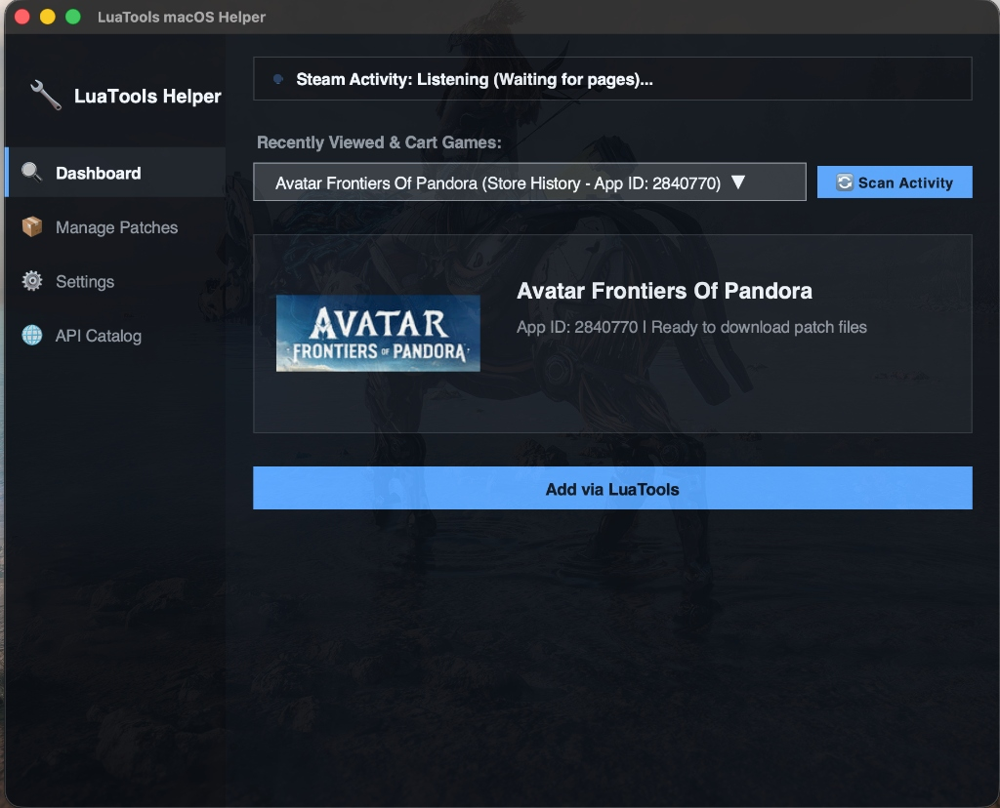
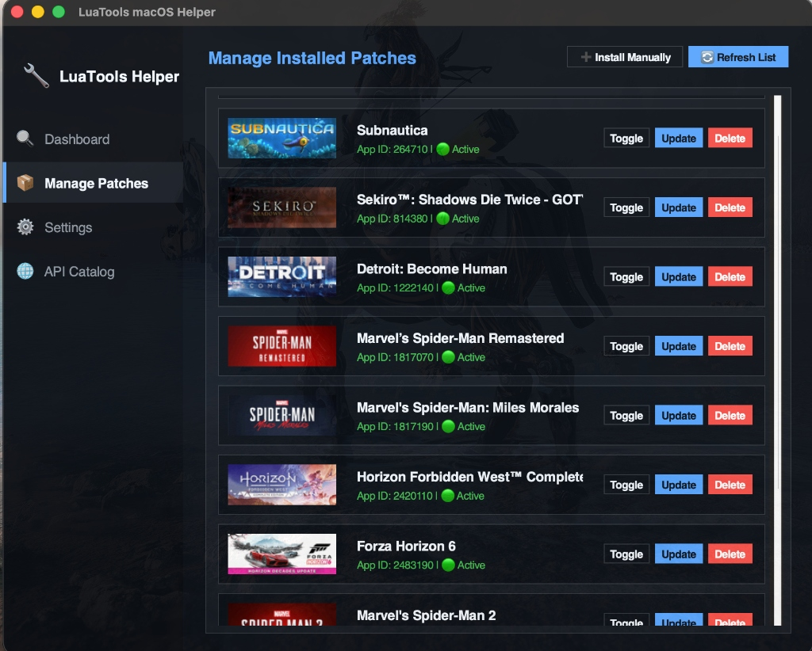
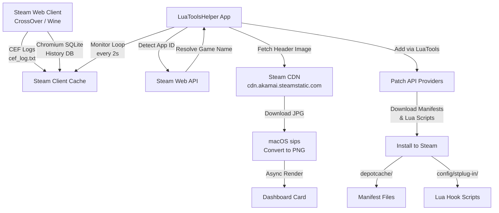

# LuaTools macOS Helper

<p align="center">
  
</p>

<p align="center">
  <b>A premium, open-source macOS utility for managing Steam game patches, manifests, and unlock fixes — built with a sleek Glassmorphic dark UI.</b>
</p>

> [!NOTE]
> This is **not** an official version of Lua Tools. It is an independent, custom take on a Manifest Manager application natively built for macOS to simplify patch management.

<p align="center">
  
  
  
  
</p>

---

## 📸 Screenshots

### Dashboard — Real-time Steam Activity Detection
<p align="center">
  
</p>

> The Dashboard automatically monitors your Steam client's browser logs and Chromium history database to detect which game page you're viewing — then displays the game name, App ID, and official capsule art, ready for one-click patching.

---

### Manage Installed Patches — Full Game Library
<p align="center">
  
</p>

> A scrollable, card-based list of all installed patches with official Steam capsule art, status indicators, and per-game action buttons (**Toggle**, **Update**, **Delete**). Supports 2-finger trackpad scrolling and mouse wheel.

---

## ⚡ Key Features

### 🎮 Dashboard — Real-time Game Detection
- **Live Steam Activity Monitor** — Background daemon tails the Chromium CEF browser logs and polls the local SQLite Chromium History database inside your CrossOver/Wine bottle in real-time.
- **Instant Game Identification** — Automatically detects which game store page is currently open in Steam, parses the App ID, and resolves the game name via the Steam API.
- **Dynamic Steam Capsule Art** — Fetches official `184×69` game header images from the Steam CDN, converts to PNG via macOS native `sips`, and renders them asynchronously without UI freezing.
- **Recently Viewed & Cart Dropdown** — Searchable, scrollable dropdown listing all games detected from your browsing and cart history during the current session.
- **One-Click Patch Installation** — Click **"Add via LuaTools"** to download and install manifests, depot caches, and Lua hook scripts in one action.

### 📦 Manage Patches — Full Library Management
- **Scrollable Game Card List** — All installed patches displayed as rich cards with capsule art, game name, App ID, and status badge (Active / Disabled / Manifest-only).
- **Smart Depot Grouping** — Parses Lua hook scripts to build a complete depot → parent game mapping, ensuring depot manifest IDs (e.g., `1039230`, `1829890`) are grouped under their correct parent games (Sekiro, Spider-Man Remastered, etc.) instead of showing as unnamed entries.
- **Per-Game Controls**:
  - **Toggle** — Enable or disable a patch instantly by renaming `.lua` ↔ `.lua.disabled`.
  - **Update** — Re-download the latest manifests from the server or install from local files.
  - **Delete** — Remove all associated Lua scripts, manifest files, and depot cache entries with a single click.
- **Install Manually** — Import `.lua` patch scripts or `.manifest` files directly from your filesystem.
- **Refresh List** — Force rescan the `stplug-in` directory and `depotcache` for any changes.

### ⚙️ Settings — Path Configuration
- **CrossOver Steam Path** — Point the app to your specific Wine/CrossOver Steam installation directory.
- **Temp Download Path** — Configure where patch files are temporarily staged during downloads.
- **Morrenus API Key** — Optional API key for accessing premium patch repositories.
- All settings persist across sessions via a local JSON configuration file.

### 🌐 API Catalog — Provider Management
- **Multiple Patch Sources** — Toggle individual API providers on or off to control where patches are fetched from.
- **API Key Validation** — Providers requiring authentication display a warning badge when the API key is missing, and auto-disable until configured.
- **URL Masking** — API keys in endpoint URLs are automatically masked in the UI for security.

### 🎨 Design & UX
- **Catppuccin Mocha Color Scheme** — Full dark theme using the Catppuccin Mocha palette for consistent, eye-friendly aesthetics.
- **Glassmorphic Window** — Native macOS translucency (`alpha: 0.94`) with subtle border highlights simulating frosted glass.
- **Animated Status Pulse** — A pulsing dot indicator on the Dashboard that cycles through colors to show real-time monitoring state.
- **Async Image Loading** — All Steam CDN images are downloaded in background threads and rendered progressively on the main thread via a thread-safe callback queue — zero stuttering or freezing.
- **Modern Sidebar Navigation** — Clean icon-based sidebar with active tab highlighting for Dashboard, Manage Patches, Settings, and API Catalog.

---

## 🚀 Setup & Installation

### Step 1: Install the macOS Application
1. Download **`LuaToolsHelper.dmg`** from the [Releases](https://github.com/VedantNarayan/LuaToolsHelper/releases) section.
2. Double-click the DMG and drag **`LuaToolsHelper.app`** to your **Applications** folder.
3. Open **LuaToolsHelper** from Applications (you may need to right-click → Open the first time to bypass Gatekeeper).

### Step 2: Configure Paths (First Launch)
1. Navigate to the **Settings** tab from the sidebar.
2. Set your **CrossOver Steam Path** to the location of your Wine/CrossOver Steam installation.
   - Default: `/Volumes/Mac_EXT/CrossOverData/CrossOver/Bottles/Steam/drive_c/Program Files (x86)/Steam`
3. Optionally set a custom **Temp Download Path** and enter your **Morrenus API Key**.
4. Click **Save Settings** — the app will automatically rescan your game library.

### Step 3: Detect & Patch Games
1. Open **Steam** (in CrossOver) and browse to any game store page, or add a game to your cart.
2. Switch to **LuaToolsHelper** — the Dashboard will automatically detect the game within ~2 seconds.
3. The detected game's name, App ID, and official capsule art appear on the Dashboard card.
4. Click **"Add via LuaTools"** to download and install all required patch files instantly.

### Step 4: Manage Installed Patches
1. Click **Manage Patches** in the sidebar to view your full library.
2. Each game card shows: capsule art, game title, App ID, active status, and manifest count.
3. Use the inline buttons:
   - **Toggle** — Enable/disable a patch without deleting files.
   - **Update** — Re-download or replace patch files (from server or local files).
   - **Delete** — Completely remove all patch files and manifests for a game.
4. Use **Install Manually** to import `.lua` or `.manifest` files directly.
5. Use **Refresh List** to force a rescan after external changes.

---

## 🛠️ Technical Architecture



### Detection Pipeline

1. **CEF Log Monitoring** — Tails `logs/cef_log.txt` from the Steam client directory. Parses URL patterns to extract App IDs from store page navigation (e.g., `store.steampowered.com/app/814380`).

2. **Chromium History Polling** — Copies the SQLite History database from `config/htmlcache/` to a temp location (bypassing Wine filesystem caching), then queries `MAX(last_visit_time)` to detect the most recently visited game page.

3. **Steam Web API Resolution** — Calls the Steam Store API (`store.steampowered.com/api/appdetails`) to resolve App IDs to human-readable game names.

4. **CDN Asset Loading** — Downloads the official `header.jpg` capsule image from `cdn.akamai.steamstatic.com/steam/apps/{appid}/header.jpg`, converts to PNG using macOS native `sips`, and caches locally.

### Patch Installation

1. **Lua Scripts** — Downloaded `.lua` hook scripts are placed in `config/stplug-in/{appid}.lua`. Each script calls `addappid()` for all required depot IDs with their content hashes.

2. **Manifest Files** — `.manifest` depot files are placed in `depotcache/{depotid}_{manifestid}.manifest`. These define the file tree and checksums for each game depot.

3. **Depot-Parent Mapping** — The app parses all `.lua` files to build a complete `depot_id → parent_app_id` mapping by extracting `addappid(depotId)` calls, ensuring multi-depot games are displayed as a single entry.

### Key Technical Decisions

| Component | Implementation | Rationale |
|---|---|---|
| UI Framework | Tkinter + Canvas | Native macOS support, no external dependencies |
| Color Scheme | Catppuccin Mocha | Consistent dark theme with WCAG-compliant contrast |
| Image Pipeline | Background threads + main-thread queue | Prevents UI freezing during network I/O |
| Scroll System | Global `bind_all('<MouseWheel>')` with smart routing | Reliable 2-finger trackpad + mouse wheel on macOS |
| History DB Access | Copy-to-temp + SQLite query | Bypasses Wine filesystem page cache staleness |
| Window Translucency | `wm_attributes("-alpha", 0.94)` | Native macOS glassmorphic effect |
| Depot Grouping | Parse `addappid()` from Lua files | Accurate parent-child mapping for multi-depot games |

---

## 👨‍💻 Build from Source

### Prerequisites
- macOS 12+ (Apple Silicon or Intel)
- Python 3.14+ with Tkinter (`brew install python-tk@3.14`)
- Homebrew (`brew.sh`)

### Build & Package
```bash
# Clone the repository
git clone https://github.com/VedantNarayan/LuaToolsHelper.git
cd LuaToolsHelper

# Build the macOS app bundle and DMG installer
./build_dmg.sh
```

The build script will:
1. Create a Python virtual environment
2. Install PyInstaller and dependencies
3. Compile `luatools_helper.py` into a standalone `.app` bundle
4. Package the bundle into a drag-and-drop `.dmg` installer

The resulting installer is at: `LuaToolsHelper.dmg`

---

## 📁 Project Structure

```
LuaToolsHelper/
├── luatools_helper.py      # Main application source (~2300 lines)
├── build_dmg.sh            # Automated build → DMG packaging script
├── create_icns.py          # Icon conversion utility (PNG → ICNS)
├── AppIcon.icns            # macOS app icon (multi-resolution)
├── AppIcon.png             # Source icon image
├── icon-windowed.png       # README logo
├── screenshots/            # UI screenshots for documentation
│   ├── dashboard.jpg       # Dashboard tab screenshot
│   └── manage_patches.jpg  # Manage Patches tab screenshot
├── ltsteamplugin/          # Millennium Steam plugin resources
├── README.md               # This file
├── .gitignore              # Build artifacts and temp files excluded
└── LuaToolsHelper.spec     # PyInstaller build specification
```

---

## 📄 License

This project is open-source and licensed under the **MIT License**.

---

<p align="center">
  <sub>Built with ❤️ for the macOS gaming community</sub>
</p>
