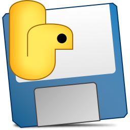
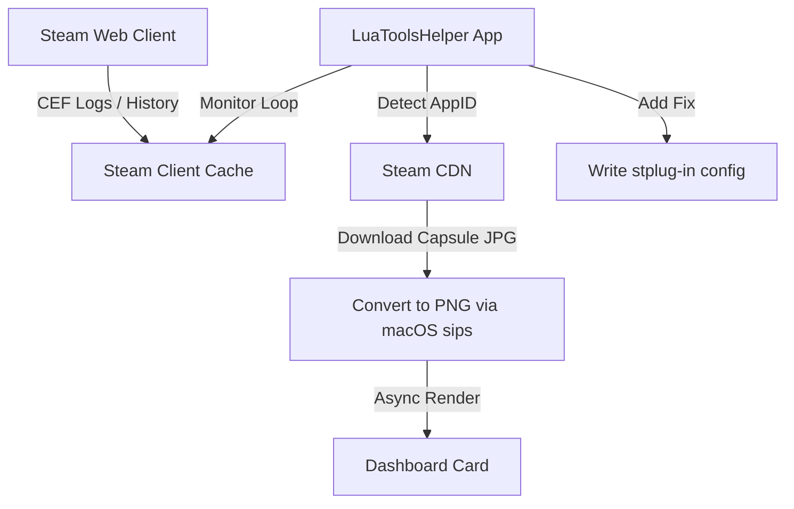

# LuaTools macOS Helper

<p align="center">
  
</p>

**LuaTools macOS Helper** is a premium, open-source utility designed to automate, patch, and manage steam library fixes for macOS users. Built with a sleek, dark **Glassmorphic interface** and native macOS translucent window sheets, it integrates seamlessly with the Millennium Steam client loader.

The helper automatically monitors your Steam client's web browser logs and active running states to detect which game store page is currently open, allowing you to fetch, install, toggle, or delete patches with a single click.

---

## ⚡ Key Features

* **Glassmorphic Glass-UI**: A sleek, dark theme with native macOS translucency (`alpha: 0.94`) and clean borders simulating glowing glass edges.
* **Dynamic Steam Game Images**: Fetches, converts, and displays official Steam game capsule images (`184x69` pixels) directly from the Steam CDN dynamically in the UI.
* **Asynchronous Image Loading**: All images are downloaded in the background and rendered progressively on the main thread via a thread-safe callback queue to ensure zero stuttering.
* **Real-time Steam Activity Detection**: Logs into active Chromium CEF views, running states, and local Chromium web history databases to immediately identify active games.
* **Dashboard Patch Manager**: Replaced legacy text lists with a modern scrollable card layout, putting status indicators, capsule art, and inline action buttons (Toggle / Delete) directly on each game card.

---

## 🚀 Setup & Installation Guide

### Step 1: Install the macOS Application
1. Download **`LuaToolsHelper.dmg`** from the [Releases](https://github.com/VedantNarayan/LuaToolsHelper/releases) section.
2. Double-click the DMG and drag **`LuaToolsHelper.app`** to your **Applications** folder.
3. Open **LuaToolsHelper** from Applications.

### Step 2: Configure Paths (First Launch Only)
1. By default, the app targets the Steam directory at `/Volumes/Mac_EXT/CrossOverData/CrossOver/Bottles/Steam/drive_c/Program Files (x86)/Steam`.
2. To change it, click the **Manage Patches** button, type or browse to your custom Steam client directory, and click **Save Settings**.

### Step 3: Auto-Detect & Patch Games
1. Open Steam and browse to any game store page or add a game to your shopping cart.
2. Open **LuaToolsHelper**. It will display the game name, AppID, and official Steam capsule art on the dashboard.
3. Click **Add via LuaTools** to download and install the unlock fixes instantly.

### Step 4: Toggle or Remove Patches
1. Click **Manage Patches** to open your installed patch dashboard.
2. Review your games list with their capsule art.
3. Click **Toggle** to instantly enable or disable a patch, or click **Delete** to clean up all files and manifests.

---

## 🛠️ How It Works (Technical Architecture)



1. **Detection**: A background daemon monitors Steam logs and SQLite Chromium databases inside the Wine environment.
2. **Dynamic Asset Loading**: Once an AppID is parsed, the helper triggers a background downloader thread to fetch game art from Steam CDN. It converts images to PNG using the native macOS `sips` engine, then caches the result locally.
3. **PE Translation & Script Injecting**: Installs required manifest patches to the local `depotcache` and hook scripts to the `stplug-in` directory.

---

## 👨‍💻 Build Instructions

To package the source code into an standalone macOS app bundle and DMG installer:
1. Ensure Python 3.14 and Homebrew are installed on your Mac.
2. Compile and package the project:
   ```bash
   ./build_dmg.sh
   ```

---

## 📄 License
This project is open-source and licensed under the MIT License.
